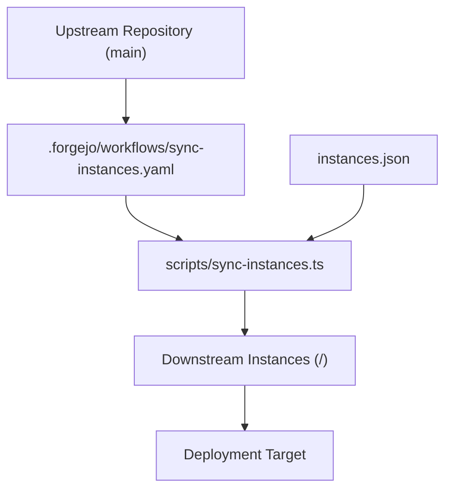

# Template Synchronization

Propagates upstream template updates to downstream instances.

---

## Architecture

Upstream changes are merged into downstream repositories using a push pipeline:



---

## File Preservation (`.gitattributes`)

Downstream content is protected from upstream overwrites using the `ours` merge driver:

```gitattributes
site.toml merge=ours
README.md merge=ours
src/exercises/** merge=ours
public/** merge=ours
```

- `scripts/sync-instances.ts` sets `git config merge.ours.driver true`.
- Upstream platform files (`src/core/`, `src/ui/`, `src/languages/`, configs) merge automatically.
- Downstream-specific files (`src/exercises/**`, `site.toml`, `README.md`, `public/**`) remain unchanged.

---

## Required Secrets

| Secret | Scope | Purpose |
|---|---|---|
| `FORGEJO_SYNC_PAT` | Upstream repository or organization | Personal Access Token with repository read/write permissions to push merges to downstream repositories |
| `CLOUDFLARE_API_TOKEN` | Organization / Environment | Deployment access token (if automated Pages deployment is enabled) |
| `CLOUDFLARE_ACCOUNT_ID` | Organization / Environment | Target account identifier for deployments |

---

## Running Sync

### Via Actions Workflow

1. Navigate to **Actions** → **Sync Template to Instances**.
2. Select **Run workflow**:
   - `target_repo`: `all` or specific slug (`<org>/<repo>`).
   - `dry_run`: `true` to validate merges without pushing.

### Via CLI

```bash
# Sync all instances listed in instances.json
npm run sync:instances

# Sync a specific instance
npm run sync:instances -- --repo <org>/<repo>

# Dry run (perform clone and merge in a temporary directory without pushing)
npm run sync:instances -- --dry-run
npm run sync:instances -- --dry-run --repo <org>/<repo>
```

### Authentication

- **CLI**: Uses local SSH credentials (`git@<host>:<org>/<repo>.git`).
- **CI**: Reads `FORGEJO_TOKEN` from the environment (`https://${FORGEJO_TOKEN}@<host>/<org>/<repo>.git`).

---

## Conflict Resolution

When a downstream instance encounters a merge conflict:
1. The sync script executes `git merge --abort`, leaving the downstream repository untouched.
2. Conflicted files are reported in the execution summary.

To resolve manually:

```bash
git clone git@<host>:<org>/<repo>.git /tmp/resolve-sync
cd /tmp/resolve-sync
git config merge.ours.driver true
git remote add upstream git@<host>:<org>/<upstream-repo>.git
git fetch upstream main
git merge upstream/main --allow-unrelated-histories
# Resolve conflicts
git commit -m "chore: resolve sync conflicts from upstream"
git push origin main
```
